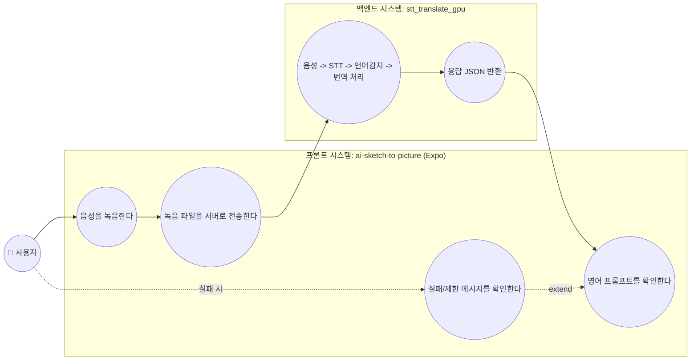
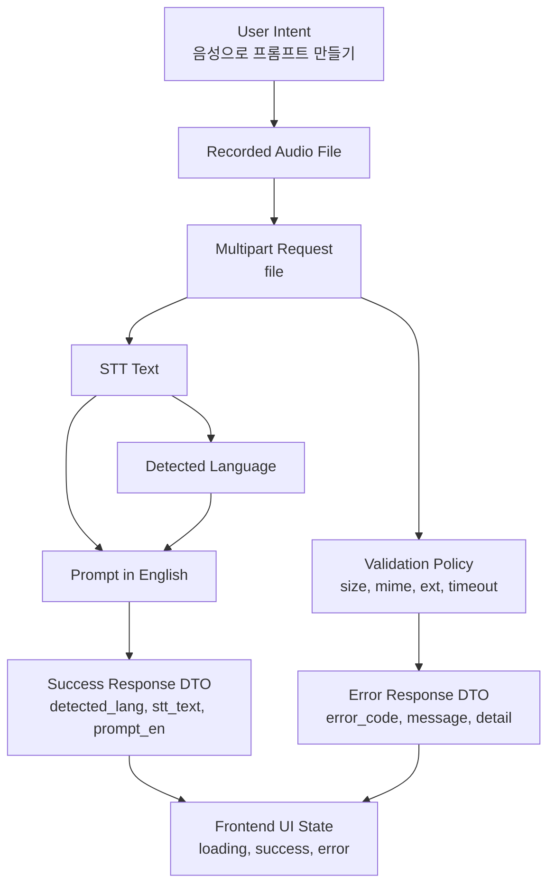
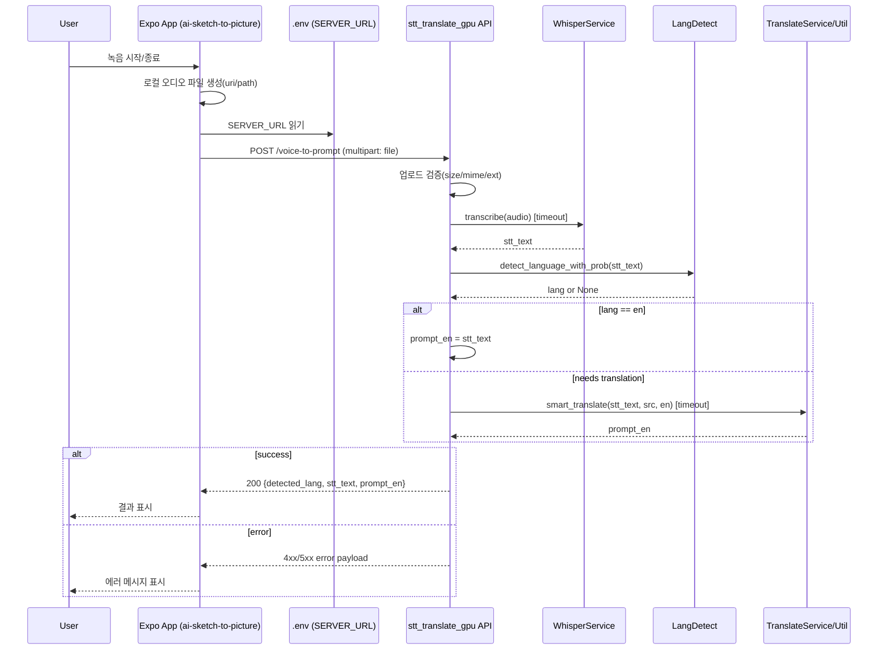
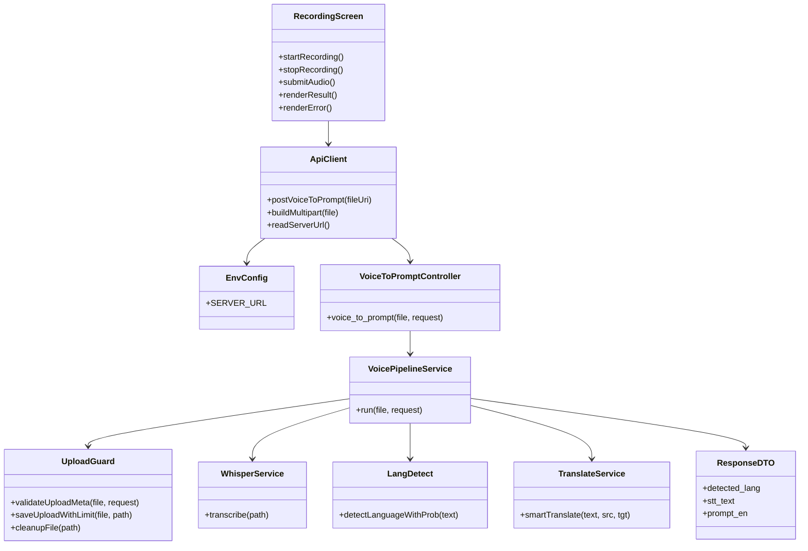

# ai-sketch-to-picture ↔ stt_translate_gpu 연동 다이어그램

본 문서는 아래 전제를 기준으로 작성한 **통합 설계 다이어그램**입니다.

- 프론트 앱: `PhilPark-geosr/ai-sketch-to-picture` (Expo 기반)
- 백엔드: 현재 로컬 프로젝트 `stt_translate_gpu`
- 프론트는 `.env`의 `SERVER_URL`로 백엔드 API를 호출
- 음성 녹음 파일을 백엔드 `POST /voice-to-prompt`로 전송

> 참고: 프론트 리포지토리 정보는 공개 페이지 기준으로 확인했습니다.  
> - [ai-sketch-to-picture (GitHub)](https://github.com/PhilPark-geosr/ai-sketch-to-picture)

---

## 1) 통합 유즈케이스 다이어그램

### 메인 시나리오
1. 사용자가 프론트 앱에서 음성을 녹음한다.
2. 프론트 앱이 녹음 파일을 `SERVER_URL`의 `/voice-to-prompt`로 전송한다.
3. 백엔드가 파일 검증 후 STT, 언어 감지, 영어 번역을 수행한다.
4. 백엔드가 `detected_lang`, `stt_text`, `prompt_en`을 반환한다.
5. 프론트가 결과를 화면에 표시한다.

### 예외 시나리오
- 용량 초과/형식 불일치/타임아웃/모델 오류 시 백엔드가 오류 응답을 반환하고, 프론트는 사용자에게 안내한다.

---

## 2) 통합 도메인 다이어그램

---

## 3) 통합 시퀀스 다이어그램

---

## 4) 통합 클래스 다이어그램 (큰 틀)

---

## 5) 연동 체크리스트 (실무 적용)

- 프론트 `.env`에 `SERVER_URL=http://<stt_translate_gpu_host>:8000` 지정
- 프론트 업로드 필드명은 `file`로 맞춤
- 백엔드 CORS 정책 확인(현재 `allow_origins=["*"]`)
- 파일 포맷/크기 제한을 프론트에서도 선검증(UX), 서버에서 최종 강제(보안)
- 오류 응답 포맷이 버전별로 다를 수 있으니(기존 `app` vs `app_v2`) 프론트 파서 분기 또는 표준화 필요

