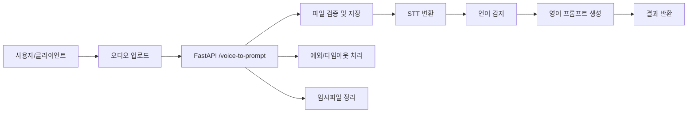
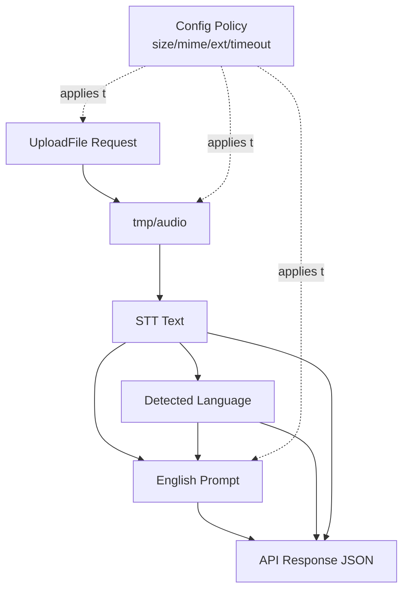
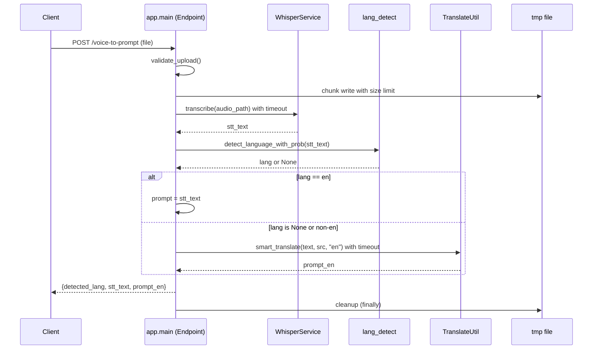
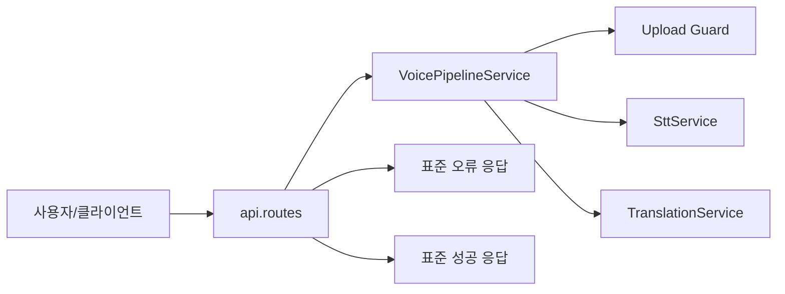
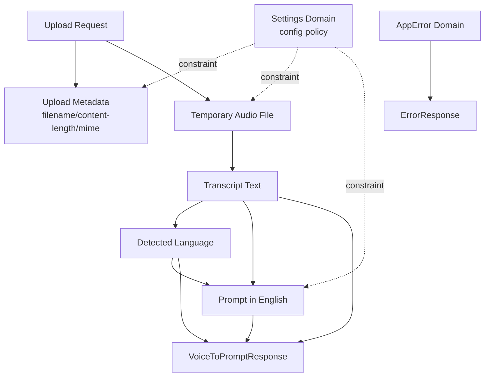
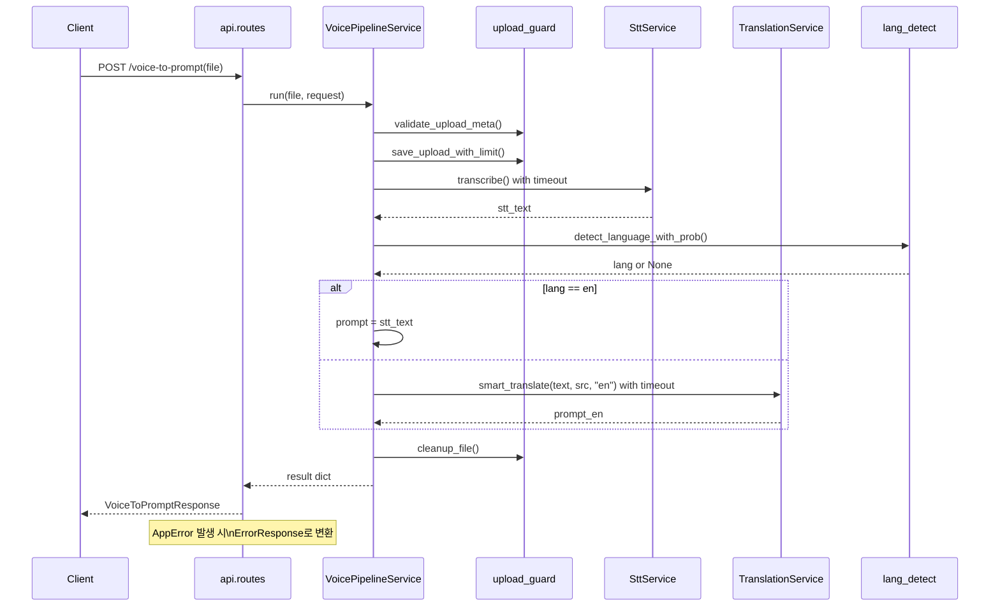
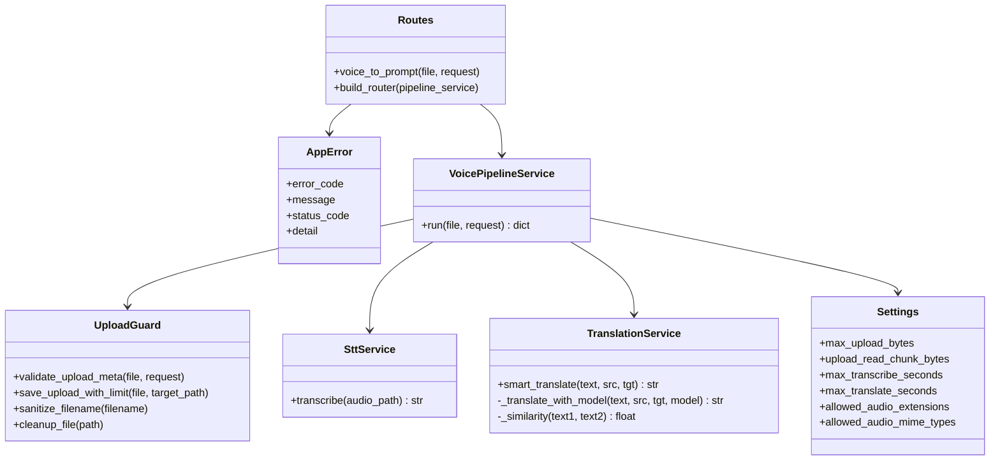

# STT Translate GPU 시스템 다이어그램 (v1 / v2)

본 문서는 현재 프로젝트의 두 버전(`app`, `app_v2`)을 큰 틀 관점에서 비교 가능한 형태로 다이어그램화한 문서입니다.  
Mermaid 기반으로 작성되어 IDE/Markdown 뷰어에서 시각화할 수 있습니다.

---

## 1) Version 1 (`app`) 다이어그램

### 1-1. 유즈케이스 다이어그램

### 1-2. 도메인 다이어그램

### 1-3. 시퀀스 다이어그램

### 1-4. 클래스 다이어그램 (큰 틀)

---

## 2) Version 2 (`app_v2`) 다이어그램

### 2-1. 유즈케이스 다이어그램

### 2-2. 도메인 다이어그램

### 2-3. 시퀀스 다이어그램

### 2-4. 클래스 다이어그램 (큰 틀)

---

## 3) 해석 포인트 (요약)
- `v1`은 endpoint(`app/main.py`)에 오케스트레이션 책임이 집중된 구조입니다.
- `v2`는 `Routes -> Pipeline -> Services`로 분리되어 변경 영향 범위가 작고 테스트 경계가 명확합니다.
- 두 버전 모두 핵심 유스케이스(업로드 -> STT -> 감지 -> 번역 -> 응답)는 동일합니다.

