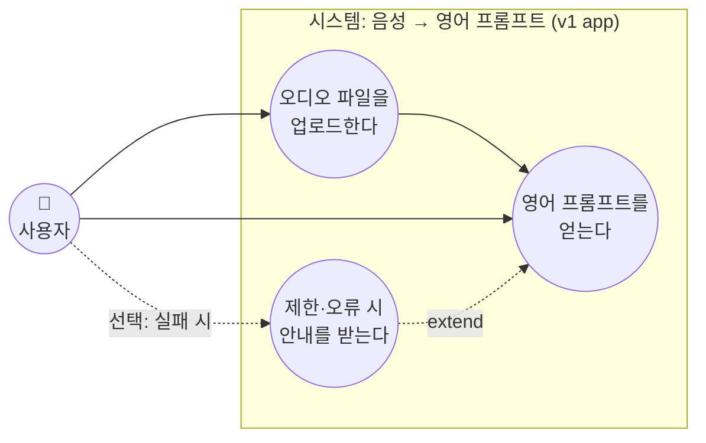
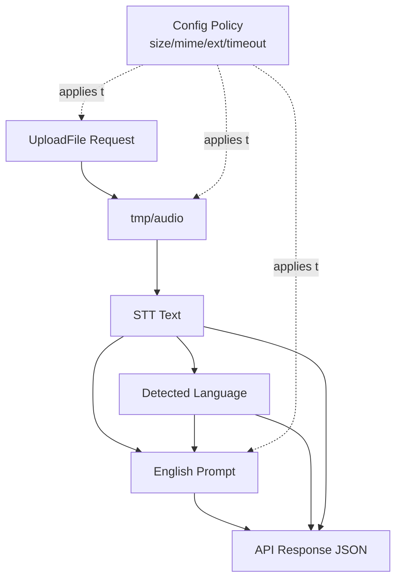
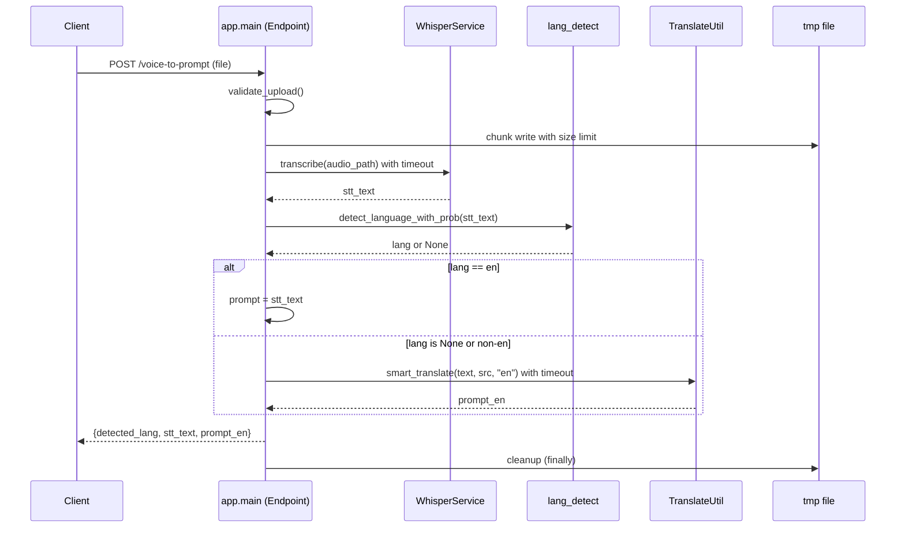
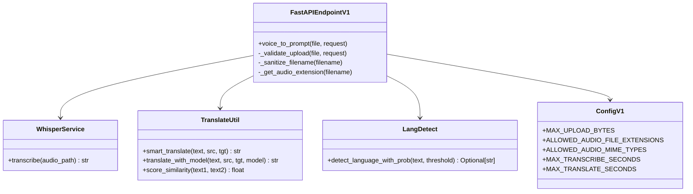
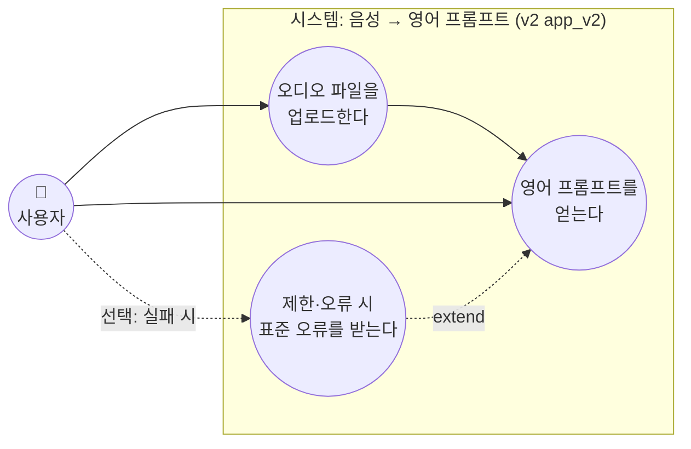
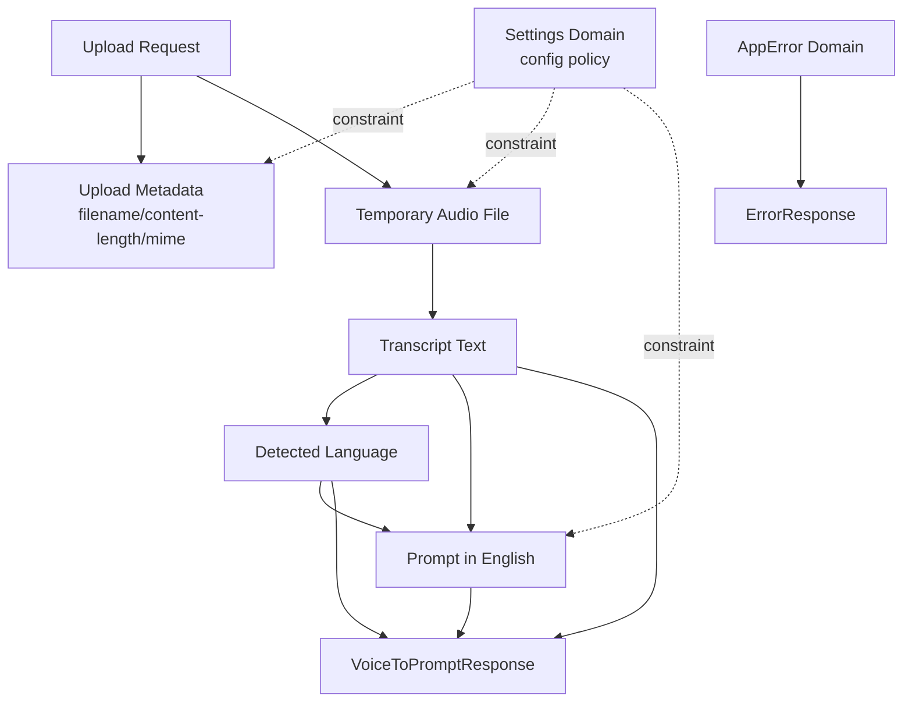
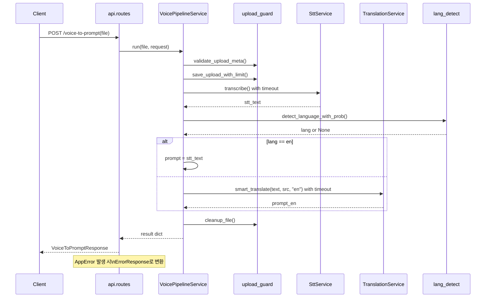
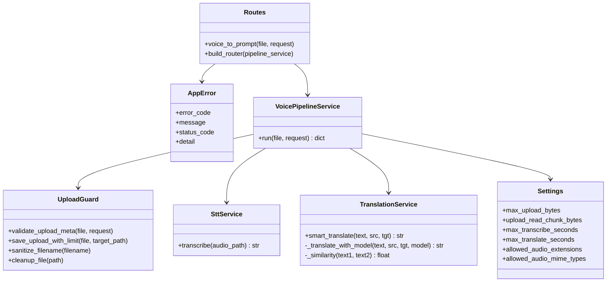

# STT Translate GPU 시스템 다이어그램 (v1 / v2)

본 문서는 현재 프로젝트의 두 버전(`app`, `app_v2`)을 큰 틀 관점에서 비교 가능한 형태로 다이어그램화한 문서입니다.  
Mermaid 기반으로 작성되어 IDE/Markdown 뷰어에서 시각화할 수 있습니다.

각 버전 섹션은 **먼저 사용자 관점의 메인 시나리오(글)**, 그다음 **유즈케이스 다이어그램(액터·시스템 경계·타원 UC)** 순서로 읽도록 구성했습니다.

---

## 1) Version 1 (`app`) 다이어그램

### 1-1. 메인 시나리오 (사용자 관점, v1 `app`)

사용자는 “음성을 넣으면 영어 프롬프트가 나온다”는 **한 가지 목표**로 시스템을 씁니다. 내부 단계(검증·저장·STT·번역)는 사용자에게 보이지 않고, 결과만 받습니다.

1. 사용자가 오디오 파일을 고른다.
2. 클라이언트가 `POST /voice-to-prompt`로 파일을 보낸다.
3. 시스템이 음성을 텍스트로 바꾼다(STT).
4. 시스템이 그 텍스트의 언어를 추정한다(실패할 수 있음).
5. 필요하면 영어로 바꿔 **영어 프롬프트**를 만든다.
6. 사용자는 JSON으로 `감지 언어`, `STT 텍스트`, `영어 프롬프트`를 받는다.

**부가·예외 흐름(같은 화면/같은 API로 “선택”되는 경우)**  
파일이 너무 크거나, 형식이 안 맞거나, 처리가 오래 걸리면 사용자는 **에러 메시지**를 받는다. 이는 메인 목표(프롬프트 획득)의 **확장·실패 분기**로 보면 됩니다.

### 1-2. 유즈케이스 다이어그램 (액터 + 시스템 경계 + 타원 UC, v1)

UML 유즈케이스에 가깝게: 왼쪽 **사용자(액터)**, 오른쪽 **시스템 경계** 안에 **타원형 유즈케이스**, 보조 목표는 점선으로 메인 UC에 연결합니다.

### 1-3. 도메인 다이어그램

### 1-4. 시퀀스 다이어그램

### 1-5. 클래스 다이어그램 (큰 틀)

---

## 2) Version 2 (`app_v2`) 다이어그램

### 2-1. 메인 시나리오 (사용자 관점, v2 `app_v2`)

사용자 입장에서 **v1과 동일한 목표**입니다. “음성 파일을 내면 영어 프롬프트를 받는다.”

1. 사용자가 오디오 파일을 고른다.
2. 클라이언트가 `POST /voice-to-prompt`로 파일을 보낸다.
3. 시스템이 내부 파이프라인(업로드 검증·저장·STT·언어 추정·번역)을 수행한다.
4. 성공 시 사용자는 **정해진 형식의 JSON**으로 `감지 언어`, `STT 텍스트`, `영어 프롬프트`를 받는다.

**v2에서 사용자에게 달라지는 점(선택적으로 체감)**  
실패 시에도 **공통 오류 JSON**(`error_code`, `message`, `detail`)을 받을 수 있어, 클라이언트가 “사람이 읽기 쉬운 문장 + 기계가 처리할 코드”를 같이 쓰기 좋습니다. 내부 구조(`routes` → `pipeline` → `services`)는 사용자에게 노출되지 않습니다.

### 2-2. 유즈케이스 다이어그램 (액터 + 시스템 경계 + 타원 UC, v2)

v1과 동일한 **사용자 목표**를 타원으로 두고, “표준 오류 응답”을 메인 UC의 **확장**으로 표현합니다.

### 2-3. 도메인 다이어그램

### 2-4. 시퀀스 다이어그램

### 2-5. 클래스 다이어그램 (큰 틀)

---

## 3) 해석 포인트 (요약)
- `v1`은 endpoint(`app/main.py`)에 오케스트레이션 책임이 집중된 구조입니다.
- `v2`는 `Routes -> Pipeline -> Services`로 분리되어 변경 영향 범위가 작고 테스트 경계가 명확합니다.
- 두 버전 모두 핵심 유스케이스(업로드 -> STT -> 감지 -> 번역 -> 응답)는 동일합니다.

